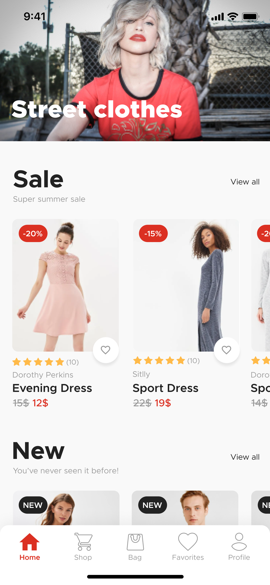

<h3 align="center">
    
    <br><br>
    <br>
</h3>

# Index

- [About](#about)
- [Tecnology](#tecnology)
- [How to use](#how-to)
- [How to contribute](#how-to-contribute)

<a id="about"></a>

## :bookmark: About

The E-commerce is a copy of the UI kit-based available on Figma. Where it simulates a clothing sales app.

<a id="tecnology"></a>

## :rocket: Tecnology

The project was developed using the following technologies

- [Javascript](https://www.javascript.com/)
- [React Native](https://reactnative.dev/)
- [Styled-components](https://styled-components.com/)
- [React Navigation](https://reactnavigation.org/)
- [Expo](https://expo.io/learn)

## :heavy_check_mark: :iphone: Mobile

- The layout is avaible on **[Figma](https://www.figma.com/file/vFCMUzfVWUDxHTUdfrvU3e/E-commerce-Application-by-Fively-Light-Version-Copy?node-id=552%3A0)**;

<h1 align="center">
    
     
    <br>
    
    
</h1>

<a id="how-to"></a>

## :fire: How to use

- ### **Requeriments**

  - It is **necessry** to have the **[Node.js](https://nodejs.org/en/)** instaled in the PC.
  - Also, it is **needed** to have ter um a package manager be the **[NPM](https://www.npmjs.com/)** or the **[Yarn](https://yarnpkg.com/)**.

1. Make a clone :

```sh
  $ git clone https://github.com/TrickSantos/ecommerce-UI-Clone.git
```

2. Execute the aplication:

```sh
  # Install the dependencies
  $ npm install
  # Or
  $ yarn

  # Start the aplication
  $ npx start
  # Or
  $ yarn start
```

<a id="how-to-contribute"></a>

## 🤔 How to contribute

- Fork this repository;
- Create a branch with your feature: `git checkout -b my-feature`;
- Make a commit with your changes: `git commit -m 'feat: My new feature'`;
- Make a push to your branch: `git push origin my-feature`.

After the merge of your pull request you can delete your branch.

## :memo: License

This project has the MIT license.

<h4 align="center">
    Made by <a href="https://www.linkedin.com/in/tricksantos/" target="_blank">Trick</a>
</h4>
